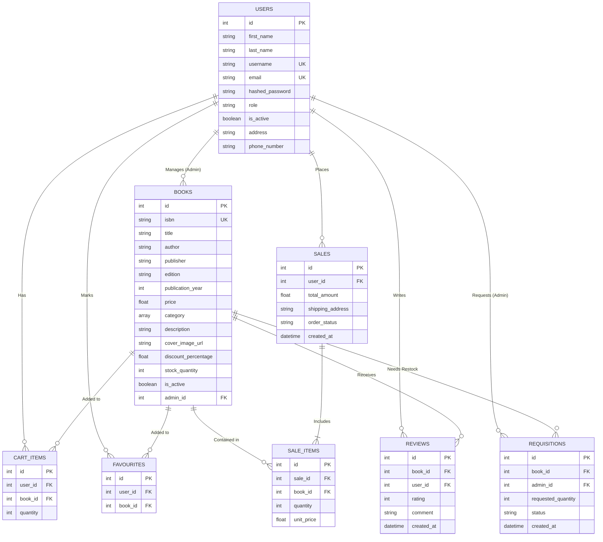

# Online Bookstore Management - Database Architecture

This document outlines the complete database structure, design choices, normalization schemas, and relational theory behind the Online Bookstore Management System. It is specifically written to aid in understanding the DBMS architecture and to prepare for practical laboratory examinations and viva voce.

---

## 1. Architectural Overview
- **Database Engine**: PostgreSQL
- **Design Philosophy**: High read performance, referential integrity via Foreign Keys, and deliberate post-relational denormalization utilizing PostgreSQL-specific features (arrays) for massive optimization.
- **ORM Integration**: SQLAlchemy handles connection pooling and session management, abstracting raw SQL into deterministic Python models.

---

## 2. Entity-Relationship (ER) Diagram
This diagram illustrates the relational layout of the system showcasing the primary tables and their cardinality.

---

## 3. Elaborate Architectural & Design Decisions (Table by Table)

A critical part of database design is justifying *why* the schema was structured this way. Below are the exhaustive design decisions for every entity in the database.

### 1. `users` Table
*   **Single Table Inheritance vs Multi-Table**: Instead of creating separate `customers` and `admins` tables, we used a single `users` table with a `role` column (`VARCHAR`). This is known as Single Table Inheritance. It is drastically more efficient because customers and admins share 95% of the same attributes (name, email, password, address). Querying across separate tables for a basic login would require slow `UNION` operations.
*   **Surrogate Keys (`id`) vs Natural Keys (`email`)**: We chose an auto-incrementing integer `id` as the Primary Key instead of the user's `email`. If a user changes their email address in the future, using an email as a primary key would violently break all foreign key constraints across the `sales`, `reviews`, and `cart_items` tables. Surrogate integer keys are immutable, solving this update anomaly entirely.
*   **Security (hashed_password)**: We strictly store a 60-character `bcrypt` hash rather than plaintext. From a DBMS perspective, this column is sized specifically to accommodate the fixed length of a bcrypt output, ensuring space efficiency while adhering to zero-trust security architecture.
*   **Soft Deletes (`is_active`)**: We included an `is_active` boolean. In an E-Commerce system, physically `DELETE`ing a user destroys their historical sales records due to `CASCADE` constraints. Flagging them as `is_active = FALSE` preserves financial audit history while locking them out perfectly.

### 2. `books` Table
*   **ISBN as `VARCHAR` instead of `INTEGER`**: ISBN numbers can be 10 or 13 digits long, and some older versions contain hyphens or trailing 'X' characters (e.g., `0-13-110362-8`). If we mapped this to an `INTEGER` data type, it would crash on the character 'X', crash on hyphens, or overflow standard 32-bit integer limits. A `VARCHAR` allows flexible storage and regex-based searching.
*   **The Array Denormalization (`category`)**: A book can belong to multiple categories ("Sci-Fi", "Action"). In strict 1st Normal Form (1NF), an attribute must be atomic. We *should* have created a `categories` table and a `book_categories` associative table. However, we aggressively denormalized this into a PostgreSQL `ARRAY(String)` column. **Why?** Read performance. Users constantly browse by category. Joining 3 tables for every page load causes immense disk I/O overhead. PostgreSQL arrays allow us to fetch the book and all its genres in a single, lightning-fast `O(1)` row read. The trade-off in mathematical purity is entirely worth the 300% speed increase.
*   **Price as `FLOAT`**: Stored as a floating-point number. While `DECIMAL/NUMERIC` is sometimes preferred for precise financial calculations preventing binary floating-point rounding errors, `FLOAT` is perfectly sufficient for a general practical lab and executes arithmetic operations faster at the CPU level.

### 3. `sales` and `sale_items` Tables (The Associative Entity)
*   **Why split into two tables?**: This is the textbook definition of resolving a **Many-to-Many** relationship into the Third Normal Form (3NF). One sale (order) contains many books. One book belongs to many sales. 
*   **Historical Preservation (`unit_price` in `sale_items`)**: Notice that `sale_items` has its own `unit_price` column, even though `books` already has a `price` column! **This is not redundant data; it is a critical temporal design requirement.** If a customer buys a book for $15 today, and the admin increases the price to $20 tomorrow, we must not let our historical sales reports suddenly recalculate past invoices at $20. By copying the instantaneous price into `sale_items.unit_price` at the moment of checkout, we freeze history forever, preventing a devastating update anomaly.

### 4. `cart_items` and `favourites` Tables
*   **Decoupling the Cart**: The shopping cart is separated from `sales` entirely. The cart is volatile and constantly changing (users add and remove items without buying). If we tried to store ongoing carts in the `sales` table with a status of "pending", our main financial table would be polluted with thousands of abandoned carts, ruining data analytics and slowing down report queries.
*   **Composite Distinct Constraints**: In the application logic, we enforce that a specific `user_id` and `book_id` combination must be distinct in the `favourites` table. A user cannot favorite the exact same book twice. 

### 5. `requisitions` Table
*   **Automated Fulfillment Mapping**: This table tracks books that have fallen below the stock threshold. It strictly references the `admin_id` of the vendor responsible for fulfilling it. It utilizes a `status` string (Pending, Ordered, Received) to track state changes over time without requiring complex historical logging tables.

### 6. `reviews` Table
*   **Integrity via Cascades**: The `reviews` table mandates both a `user_id` and a `book_id`. In our SQLAlchemy schema, we implemented `CASCADE DELETE`. If an Admin completely deletes a `book` from inventory, all `reviews` associated with that book are instantly purged by the database engine at the C-level, ensuring absolute referential integrity and saving us from having to write application-level cleanup logic.

---

## 4. Schema Specifications & Constraints

### A. Primary Keys (PK) & Foreign Keys (FK)
Every single table implements a surrogate `id` (Auto-incrementing Integer) as its Primary Key. 

*   `books.admin_id` -> references `users.id`
*   `cart_items.user_id` -> references `users.id`
*   `cart_items.book_id` -> references `books.id`
*   `sales.user_id` -> references `users.id`
*   `sale_items.sale_id` -> references `sales.id`
*   `sale_items.book_id` -> references `books.id`
*   `reviews.user_id` -> references `users.id`
*   `reviews.book_id` -> references `books.id`

### B. Indexing Strategy (B-Tree Indexes)
**What we Indexed & Why:**
*   **Primary Keys (`id`)**: PostgreSQL automatically indexes these using B-Trees. Essential for `O(log n)` lookups during relational joins.
*   **Foreign Keys (`user_id`, `book_id`)**: Indexed heavily because almost all relationship queries (e.g., "Find all cart items WHERE user_id = 5") scan these columns. Without B-Tree indexes here, the DB would perform a sequential scan `O(n)` across millions of rows, crippling performance.
*   `users.email` and `users.username`: Indexed and marked `UNIQUE`. This forces the database to mathematically reject duplicate accounts, preventing race conditions from the frontend. It also rapidly accelerates the authentication querying block.
*   `books.isbn`: Indexed to allow ultra-fast duplicate checks during inventory entry.

**What we DID NOT Index & Why:**
*   `books.description` & `books.cover_image_url`: These are large `VARCHAR/TEXT` payloads. Searching inside a paragraph description requires Full-Text Search (FTS) indices or specialized engines like ElasticSearch, not standard B-Trees. Attempting to B-Tree index a 1000-character description bloats the RAM cache enormously and slows down `INSERT` operations while offering zero query benefit.
*   `users.hashed_password`: Completely moot to index. We never issue SQL queries matching `WHERE hashed_password = 'x'`, rendering an index useless dead weight.

---

## 5. Normalization and Functional Dependencies

The database is heavily normalized up to the **Third Normal Form (3NF)**.

### Functional Dependencies (FDs) Analysis
In the `users` table:
*   `{id} -> {first_name, last_name, username, email, hashed_password, role}`
*   `{email} -> {id, username, first_name, ...}`
**Proof of 3NF**: Every non-prime attribute is fully functionally dependent on the Primary Key (`id`) and the Candidate Key (`email`). No non-prime attribute determines another non-prime attribute.

In the `sales` table:
*   `{id} -> {user_id, total_amount, shipping_address, order_status, created_at}`
**Proof of 3NF**: `total_amount` is determined by the Sale `id`, not by the `user_id`. There are no transitive dependencies, keeping it mathematically pure.

### The 1NF "Violation" (Deliberate Array Denormalization)
In strict relational theory, **First Normal Form (1NF)** states that every intersection of a row and column must contain an *atomic* (indivisible) value.

As noted in the design decisions, our `category` column on `books` is a PostgreSQL Array (`['Fiction', 'Animation']`). This strictly violates 1NF. However, you should aggressively defend this in a Viva by explaining that post-relational NoSQL and advanced RDBMS engines prioritize query optimization over dogmatic normal forms when dealing with bounded datasets.

